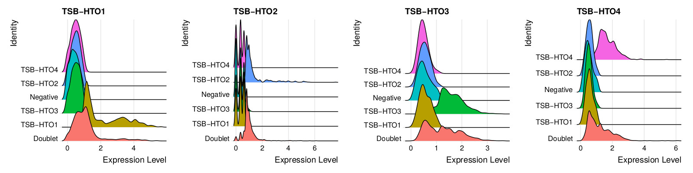
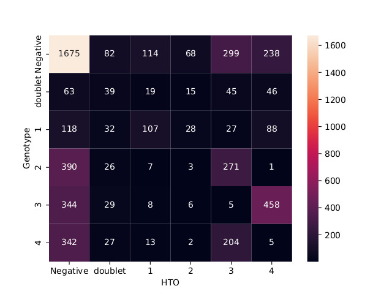

# Genotype Demultiplexing Methods

The following is a report describing the use of a genotype-based demultiplexing tool (souporcell) on the LRA Oct2023 scATACseq experiment.

#### Date:
03Jan2024
#### Author:
jrose

## Motivation

LRA001 scATACseq experiment  

4 individuals pooled and tagged with HTO for downstream demultiplexing



*HTO-2 tag seems to have worked poorly, making calling demultiplexed cells difficult*

Question:
**Can we use genotyping demultiplexing methods to assign cells to individuals when HTO tags fail?**


## Methods

I evaluated three potential genotype demultiplexing tools :

| Tool Name  | Inputs                      | Notes              | github                                          | Paper                                            |
|------------|-----------------------------|--------------------|-------------------------------------------------|--------------------------------------------------|
| souporcell | bam, barcodes.tsv           | Seems more popular | https://github.com/wheaton5/souporcell          | https://www.biorxiv.org/content/10.1101/699637v1 |
| scSplit    | bam, VCF from bam, barcodes |                    | https://github.com/jon-xu/scSplit               | https://doi.org/10.1186/s13059-019-1852-7        |
| cellSNP    | bam, barcodes, VCF from bam | Uses pysam         | https://github.com/single-cell-genetics/cellSNP | https://doi.org/10.1093/bioinformatics/btab358   |

Selected souporcell because:

* It is more highly cited
* It does not require external VCF file/SNP calling (it's built-in using freebayes)

#### souporcell tool

https://github.com/wheaton5/souporcell


Requires:

1. Bam file (possorted_bam.bam)

2. CellRange barcode file (barcodes.tsv)

3. Ref geneome (i.e. Hg38)

Sample code:

```
sudo singularity exec -B {PATH/TO/INPUTS:/CONTAINER/PATH} souporcell_latest.sif souporcell_pipeline.py -i {bam.bam} -b {barcodes.tsv} -f {refgenome.fa} -t 24 -o /output -k 4
```

-t : max threads used
-k : number of individuals mixed in sample
-o: output directory name

NOTE:
*To run 10X scATAC data you must also add `--no_umi True` tag*

## Results

Number of cells detected by either genotype-based demultiplexing or HTO-based method

| Geno:      | Genotype | HTO  |
|------------|------|------|
| unassigned | 4298 | 2932 |
| singlet    | 2543 | 2077 |
| doublet    | 228  | 235  |


#### Q: Are assignments similar between methods?

*Sometimes...*



Notes:
* ***Number assignments for Genotyped individuals is arbitrary**
* *HTO1 is shown as 1 in plot...HTO2 is 2, etc*

## Conclusions

*  Demultiplexing using genotyping can be done easily using souporcell tool

* More singlet cells can be determined via genotype method than LRA001 ATAC/ASAP HTO experiment

* Agreement between HTO and genotype depends on individual HTO tag

* Genotype demultiplex can successfully recover more cells from failed HTO-2 tag

* HTO-3 group seems to mixed genotype....perhaps doublet contamination (see ridge plot)?

## Next Steps

* Try souporcell with LRA001 RNA experiment (better HTO results?). Will this lead to better agreement between methods?

* Recommend sticking to one or the other for future analysis (Choose either HTO or genotype...maybe confusing to try and use both)